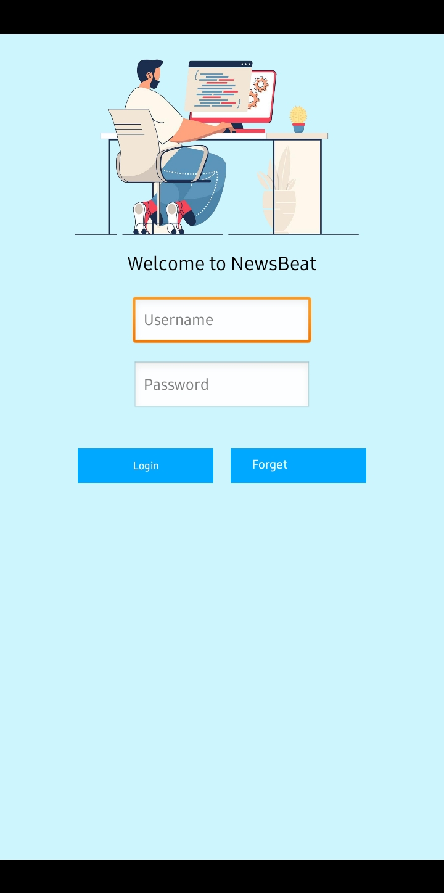
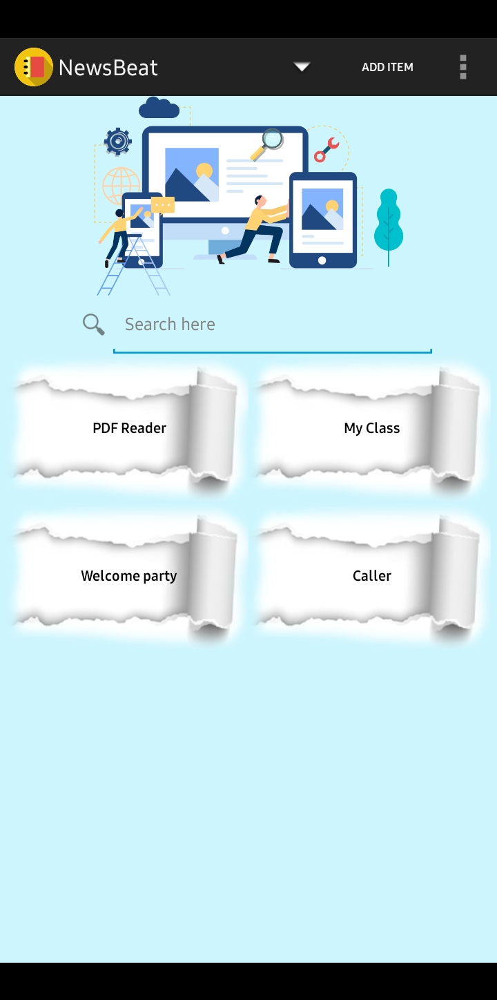
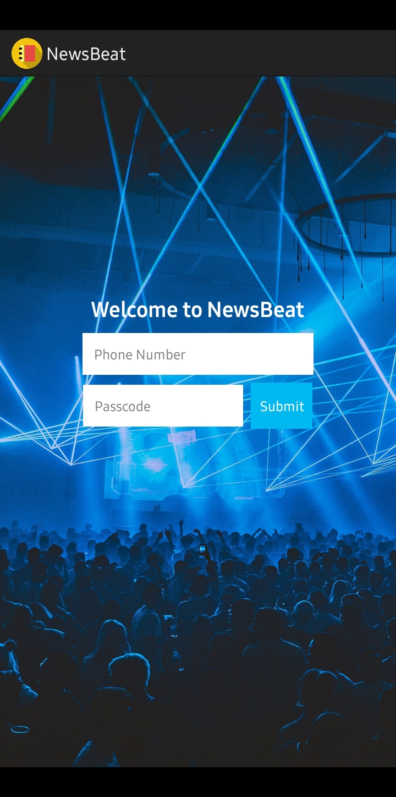
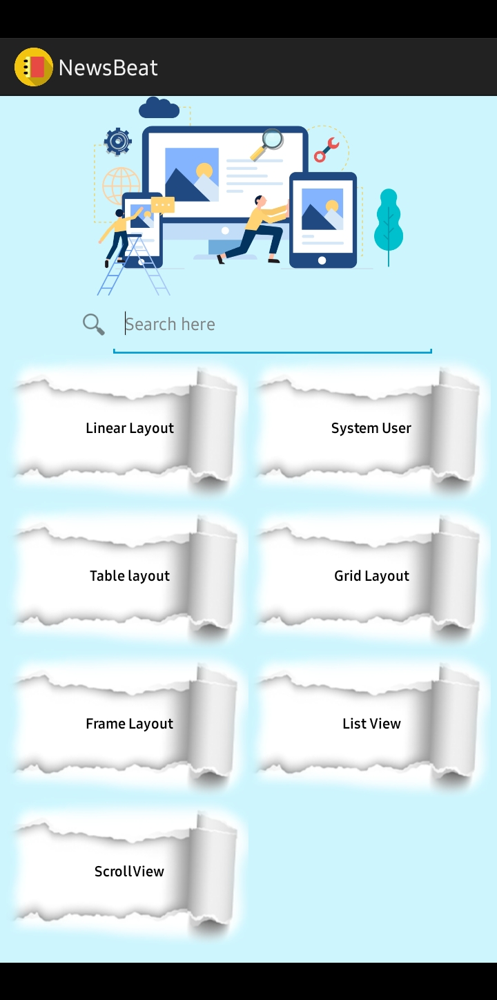
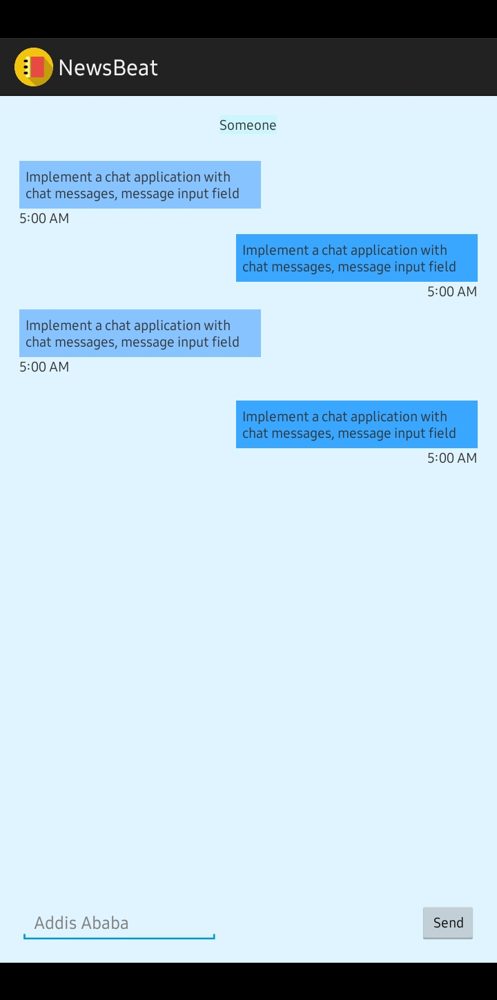
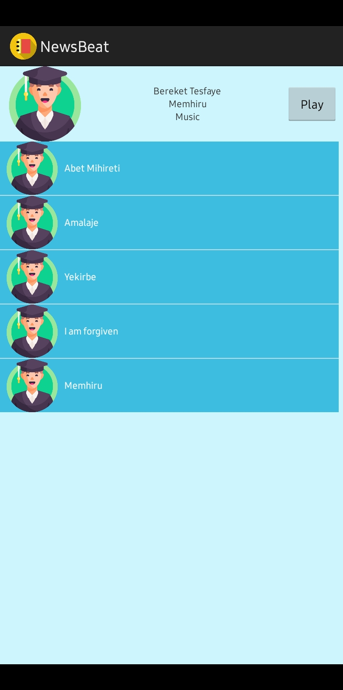
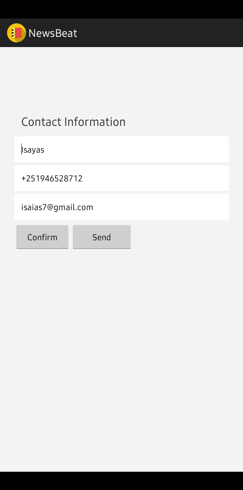

Certainly! Below is a sample README file for your Java and SQLite Database lab project. Adjust the details based on your project specifics.

---

# Android Lab Project - Java and SQLite Database

## Overview

This lab project is developed using Java and utilizes an SQLite database to manage and store data efficiently. It serves as a practical implementation of core Java concepts and database interactions.

## Features

- **Data Management:** Efficient handling of data using Java and SQLite.
- **User Interface:** Simple and intuitive user interface for easy interaction.
- **CRUD Operations:** Support for Create, Read, Update, and Delete operations on data.
- **Data Validation:** Implementing validation to ensure data integrity.
- **Logging:** Utilizing logging mechanisms for tracking and debugging.
- ...

## Installation

### Prerequisites

- Java Development Kit (JDK)
- SQLite Database

### Steps

1. **Clone the Repository:**

   ```bash
   git clone https://github.com/EbisaGirma21/Android_Lab_Project_With_Java.git
   cd Android_Lab_Project_With_Java
   ```

2. **Compile and Run:**

   ```bash
   javac MainActivity.java
   java Main
   ```

   Ensure that you have the required dependencies in your classpath.

3. **Database Setup:**

   Create an SQLite database and update the connection details in the project. You may use tools like SQLite CLI or DB Browser.

4. **Run the Project:**

   ```bash
   java Main
   ```

   This will start the application, and you can interact with it through the command line or any other UI you've implemented.

## Technologies Used

- **Java:** Core programming language for application logic.
- **SQLite Database:** Lightweight and efficient database for data storage.
- **Logging Framework:** (if used)
- ...

## Project Structure

- **`src/`**: Source code files.
- **`lib/`**: External libraries or JAR files.
- **`docs/`**: Documentation files (if any).
- ...


## Screenshots 📷

&nbsp;&nbsp;&nbsp;
&nbsp;&nbsp;&nbsp;
&nbsp;&nbsp;&nbsp;

<br>
&nbsp;&nbsp;&nbsp;
&nbsp;&nbsp;&nbsp;
&nbsp;&nbsp;&nbsp;


## Contributing

Contributions are welcome! Please follow the [Contribution Guidelines](CONTRIBUTING.md).

## Feedback

I appreciate your input! If you have any suggestions, encounter issues, or have feature requests, kindly raise them by opening an issue on our GitHub repository. Your feedback is valuable to Me! [GitHub repository](https://github.com/EbisaGirma21/Android_Lab_Project_With_Java/issues).

## License

This project is licensed under the [MIT License](LICENSE).
